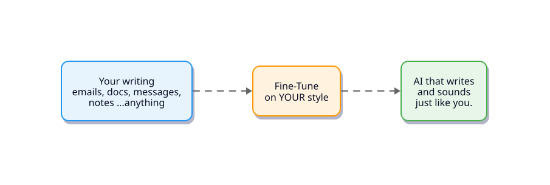

# Customain



**Fine-tune LLMs to sound like you.**

Customain learns your writing style from your own real text content, and conversations, and fine-tunes (large) language models to mimic your tone, voice, and communication patterns. The result is your custom AI that does not sound generic, but just like *you*.

## How It Works

```text
Your emails → Extract & clean → Fine-tune → A model that writes like you
```

1. **Connect** a content source (Gmail today, more coming)
2. **Process** your text into high-quality, anonymized training pairs
3. **Fine-tune** OpenAI models on your writing style
4. **Evaluate** how well the model captures your tone — with both classical metrics and a trained authorship classifier

## Supported Sources

| Source          | Status       |
| --------------- | ------------ |
| Gmail           | ✅ Available |
| Outlook         | 🔜 Planned   |
| Slack           | 🔜 Planned   |
| Notion          | 🔜 Planned   |
| Google Docs     | 🔜 Planned   |

## Supported Providers

| Provider | Models | Methods | Status |
| -------- | ------ | ------- | ------ |
| **OpenAI** | GPT-4.1, 4.1-mini, 4.1-nano| SFT, DPO | ✅ Available |
| **Together AI** | Llama, Mixtral, Qwen + any HF model | -- | 🔜 Planned |
<!-- | **Fireworks AI** | Llama, Mixtral + open-source models | -- | 🔜 Planned |
| **Google Vertex AI** | Gemini 2.5 Flash/Lite, 2.0 Flash | -- | 🔜 Planned |
| **Mistral AI** | Mistral Small 3.1, Medium | -- | 🔜 Planned |
| **Cohere** | Command A, R+, R, Aya Expanse | -- | 🔜 Planned | -->

## Quick Start

### Prerequisites

- Python 3.11+
- [uv](https://docs.astral.sh/uv/) package manager
- OpenAI API key
- Gmail OAuth credentials (for Gmail source)

### Installation

```bash
git clone https://github.com/user/customain.git
cd customain
uv sync
```

### Configure API Keys

Create `.secrets/api_keps.json`:

```json
{
  "openai_api_key": "sk-...",
  "wandb_api_key": "optional-for-tracking"
}
```

For Gmail, you'll also need OAuth credentials — see [Google's guide](https://developers.google.com/gmail/api/quickstart/python).

### Step 1 — Build Your Dataset

Run the full Gmail preprocessing pipeline:

```bash
uv run python -m gmail_preprocessing_pipeline.run_pipeline
```

Each run now creates a versioned dataset under `data/gmail/<timestamp>/`, where the
timestamp is taken from the exported mbox filename. Inside each version you get
separate folders per dataset type, for example:

```text
data/gmail/20260505_101530/
  _intermediate/
  sft/
    train.jsonl
    test.jsonl
    train_mock.jsonl
    test_mock.jsonl
  dpo/
    train.jsonl
    test.jsonl
    train_mock.jsonl
    test_mock.jsonl
  authorship/
    train.jsonl
    val.jsonl
  manifest.json
```

Build only the dataset types you need:

```bash
uv run python -m gmail_preprocessing_pipeline.run_pipeline --targets sft
uv run python -m gmail_preprocessing_pipeline.run_pipeline --targets sft authorship
```

Limit how much mail is exported:

```bash
# Only recent mail
uv run python -m gmail_preprocessing_pipeline.run_pipeline --newer-than-days 30

# Cap the export size
uv run python -m gmail_preprocessing_pipeline.run_pipeline --max-threads 250

# Add an extra Gmail query filter
uv run python -m gmail_preprocessing_pipeline.run_pipeline \
  --gmail-query "label:important -category:promotions"
```

Or skip steps you've already completed:

```bash
# Already exported Gmail — start from extract
uv run python -m gmail_preprocessing_pipeline.run_pipeline --start-from 2

# Re-run dataset building from existing processed pairs
uv run python -m gmail_preprocessing_pipeline.run_pipeline --start-from 4 --targets sft dpo
```

The pipeline runs 4 steps:

1. **Export** Gmail threads to mbox
2. **Extract** email-reply pairs
3. **Transform** pairs in one LLM pass: clean + filter + anonymize
4. **Build** the selected dataset folders (`sft`, `dpo`, `authorship`)

### Step 2 — Fine-Tune & Evaluate

Configure which models and hyperparameters to try in `ft/training_configs.py`, then run the full pipeline:

```bash
uv run python -m ft.run_pipeline \
  --data-dir data
```

By default this uses the latest dataset version under `data/gmail/`.

Or run a quick test with a small subset first:

```bash
uv run python -m ft.run_pipeline \
  --data-dir data \
  --test-run
```

You can also skip steps you've already completed:

```bash
# Skip data upload and job launch, just evaluate
uv run python -m ft.run_pipeline \
  --data-dir data \
  --skip 1 2
```

The pipeline will:

1. Upload data and launch fine-tuning jobs across your configured model/hyperparameter combinations
2. Poll until all jobs complete
3. Run each fine-tuned model on the test set
4. Evaluate results and log metrics to [Weights & Biases](https://wandb.ai)

## Evaluation

Customain includes a pluggable evaluation framework. Evaluators are auto-discovered. You can just drop a new one into `ft/evaluation/evaluators/`. It can be ml-based, statistical, or any other form you prefer. Take a look at the existing ml-based and metric/statistical evaluators already implemented:

| Evaluator                | What it measures                           |
| ------------------------ | ------------------------------------------ |
| `authorship_classifier`  | CNN-based authorship probability score     |
| `tone_judge`             | LLM-as-judge scoring tone & style fidelity |
| `bleu`                   | N-gram overlap (BLEU score)                |
| `meteor`                 | Token-level alignment (METEOR score)       |
| `semantic_similarity`    | Embedding cosine similarity                |

Configure which evaluators to skip in `ft/training_configs.py`:

```python
skip_evaluators = ["bleu", "meteor"]  # Only run tone_judge and semantic_similarity
```

### Authorship Classifier

A character-level CNN text classifier trained to distinguish the author's writing from other people's writings. Unlike LLM-as-judge evaluators, this learns style patterns directly from data, hence it does not suffer from the LLM-as-a-judge performance issues. Its current best performance is `91%` precision.

```bash
# Prepare training data from the latest versioned SFT dataset
uv run python -m classifiers.authorship.prepare_data

# Train (logs to W&B under customain-classifiers)
uv run python -m classifiers.authorship.train \
  --train-data data/gmail/<timestamp>/authorship/train.jsonl \
  --val-data data/gmail/<timestamp>/authorship/val.jsonl

# The authorship_classifier evaluator auto-registers and uses the trained checkpoint
```

## License

This project is licensed under the [GNU Affero General Public License v3.0 (AGPLv3)](license.txt).
